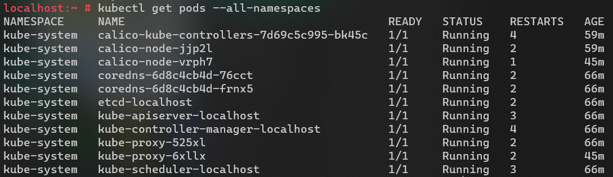

# Calico openEuler
openEuler based docker image for calico.

[Kubenetes Configuration yaml File for Calico openEuler](calico-openEuler.yaml)

## Test Result after [Deployed to Kubernetes](https://hollowmansblog.wordpress.com/2022/01/28/deploy-a-kubernetes-cluster-based-on-calico-and-opensuse-kubic/)
### Calico Node Pod Events

### Kubenetes All Pods Status

### Kubenetes Nodes Status

### Workload Pod Events

### Workload Pod Log

### Calicoctl Result

### Arm64 Based Result

